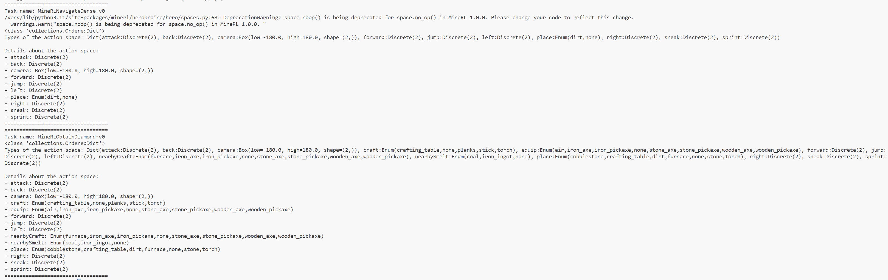
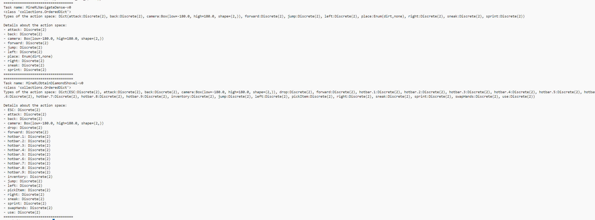

# DreamerV3 with MineRL from v0.4.4 to v1.0.2

DreamerV3 is based on MineRL v0.4.4 for experiments. This repository is based on the DreamerV3 algorithm and updates the <font color=yellow>MineRL version from v0.4.4 to v1.0.2</font>. Its image resolution, action space, and number of tasks are closer to real scenes, and the research significance is greater.

## DreamerV3 with MineRL v0.4.4
DreamerV3 learns a world model from experiences and uses it to train an actor
critic policy from imagined trajectories. The world model encodes sensory
inputs into categorical representations and predicts future representations and
rewards given actions.

- [Research paper](https://www.nature.com/articles/s41586-025-08744-2)
- [Project website](https://github.com/danijar/dreamerv3)

## DreamerV3 with MineRL v1.0.2
The update of DreamerV3 with MineRL from v0.4.4 to v1.0.2:
- MineRL version from v0.4.4 to v1.0.2
- Solve the version dependency library conflict problem
- Solve the interface conflict problem between DreamerV3 and MineRL v1.0.2
- Solve the action space mismatch problem
- Solve the image resolution mismatch problem

>The DreamerV3 code with MineRL v1.0.2 has been tested on Linux and Windows and requires Python 3.11+.

## Install

- Docker install script:
```sh
git clone https://github.com/fengtt42/dreamerv3_MineRL_v1.0.2
cd dreamerv3_MineRL_v1.0.2
docker build -f Dockerfile -t dreamer:v1 .
```

- Docker test script:
```shell
docker run -it dreamer:v1 /bin/bash
docker ps -a
docker stop <contain_id>
docker rm <contain_id>
```

- Docker training script:
```sh
docker run -it --rm --gpus all -v ~/logdir:/root/logdir -v ~/dreamerv3_MineRL_v1.0.2:/app dreamer:v1  /bin/bash
python dreamerv3/main.py --logdir ~/logdir/Minecraft/{timestamp} --configs minecraft debug --task minecraft_diamond
```
>docker run -it --rm --gpus all -v ~/logdir:/root/logdir -v ~/ftt/dreamerv3_MineRL_v1.0.2:/app dreamer:v1  /bin/bash
> 
>python dreamerv3/main.py --logdir ~/logdir/ftt/{timestamp} --configs minecraft debug --task minecraft_diamond

## Tips

- All config options are listed in `dreamerv3/configs.yaml` and you can
  override them as flags from the command line.
- The `debug` config block reduces the network size, batch size, duration
  between logs, and so on for fast debugging (but does not learn a good model).
- By default, the code tries to run on GPU. You can switch to CPU or TPU using
  the `--jax.platform cpu` flag.
- You can use multiple config blocks that will override defaults in the
  order they are specified, for example `--configs crafter size50m`.
- By default, metrics are printed to the terminal, appended to a JSON lines
  file, and written as Scope summaries. Other outputs like WandB and
  TensorBoard can be enabled in the training script.
- If you get a `Too many leaves for PyTreeDef` error, it means you're
  reloading a checkpoint that is not compatible with the current config. This
  often happens when reusing an old logdir by accident.
- If you are getting CUDA errors, scroll up because the cause is often just an
  error that happened earlier, such as out of memory or incompatible JAX and
  CUDA versions. Try `--batch_size 1` to rule out an out of memory error.
- Many environments are included, some of which require installing additional
  packages. See the `Dockerfile` for reference.
- To continue stopped training runs, simply run the same command line again and
  make sure that the `--logdir` points to the same directory.


## Disclaimer

If you have any questions, please feel free to ask.

## 进度

### 4.11

在dev分支上跑通了640*360的网络结构，问题是：非常慢！！！

### 4.13

搞清楚了0.4.4和1.0.2的action space差别，准备改了。

存在一个问题就是：在0.4.4中 Diamond任务叫做MineRLObtainDiamond-V0,在1.0.2中Diamond任务叫做MineRLObtainDiamondShovel-V0

具体如下：

0.4.4


1.0.2


1.0.2相对于0.4.4

多了：drop, hotbar.1, hotbar.2, hotbar.3, hotbar.4, hotbar.5, hotbar.6, hotbar.7, hotbar.8, hotbar.9, inventory, pickItem, swapHands, use

少了: craft, equip, nearbyCraft, nearbySmelt, place

所以现在需要通过1.0.2多的，来将craft, equip, nearbyCraft, nearbySmelt, place组合出来。

目前存在着的一个组合方案值得商榷。

**新的问题**：Reward用作版本适配吗